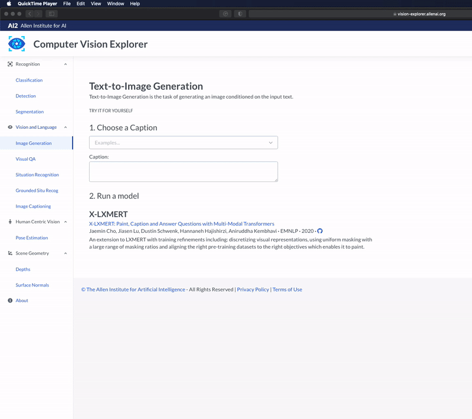

# X-LXMERT: Paint, Caption and Answer Questions with Multi-Modal Transformers ([EMNLP 2020](https://2020.emnlp.org/))

* Authors: [Jaemin Cho](https://j-min.io), [Jiasen Lu](https://www.cc.gatech.edu/~jlu347/), [Dustin Schwenk](https://www.semanticscholar.org/author/D.-Schwenk/34846449), [Hannaneh Hajishirzi](https://homes.cs.washington.edu/~hannaneh/), and [Ani Kembhavi](https://anikem.github.io/)
* [Paper](https://www.semanticscholar.org/paper/X-LXMERT%3A-Paint%2C-Caption-and-Answer-Questions-with-Cho-Lu/e5fb7a72807af36a7d39049346b3feb422a50c3c)
* [Blog](https://prior.allenai.org/projects/x-lxmert)
* [Demo](https://vision-explorer.allenai.org/text_to_image_generation)
* [Slideslive Presentation](https://slideslive.com/38938675/xlxmert-paint-caption-and-answer-questions-with-multimodal-transformers)

# Summary
Recent multi-modal transformers have achieved tate of the art performance on a variety of multimodal discriminative tasks like visual question answering and generative tasks like image captioning. This begs an interesting question: Can these models go the other way and generate images from pieces of text? Our analysis of a popular representative from this model family - LXMERT - finds that it is unable to generate rich and semantically meaningful imagery with its current training setup. We introduce X-LXMERT, an extension to LXMERT with training refinements. X-LXMERT's image generation capabilities rival state of the art generative models while its question answering and captioning abilities remains comparable to LXMERT.

# Demo
Try out [AI2 Computer Vision Explorer Demo](https://vision-explorer.allenai.org/text_to_image_generation)!




# Install

* Python packages

```bash
pip install -r ./requirements.txt
```
* [Mask-RCNN-benchmark](https://gitlab.com/vedanuj/vqa-maskrcnn-benchmark) (for feature extraction)
  - Please follow [the original installation guide](https://gitlab.com/vedanuj/vqa-maskrcnn-benchmark/-/blob/master/INSTALL.md).

* [Faiss](https://github.com/facebookresearch/faiss) (for K-means clustering)
  - Please follow [the original installation guide](https://github.com/facebookresearch/faiss/blob/master/INSTALL.md).

# Code structure
```
# Store images, features, and annotations
./datasets
    COCO/
        images/
        featuers/
    VG/
        images/
        features/
    GQA/
        images/
        features/
    nlvr2/
        images/
        features/
    data/               <= Store text annotations (*.json) for each split
        lxmert/
        vqa/
        gqa/
        nlvr2/

# Run feature extraction and k-means clustering
./feature_extraction

# Train image generator
./image_generator
    snap/       <= Store image generator checkpoints
    scripts/    <= Bash scripts for training image generator

# Train X-LXMERT
./x-lxmert
    src/
        lxrt/           <= X-LXMERT model class implementation (inherits huggingface transformer's LXMERT class)
        pretrain/       <= X-LXMERT Pretraining
        tasks/          <= Fine-tuning on downstream tasks (VQA, GQA, NLVR2, Image generation)
    snap/       <= Store X-LXMERT checkpoints
    scripts/    <= Bash scripts for pretraining, fine-tuning, and image generation
```


# Feature extraction

```bash
cd ./feature_extraction

# For Pretraining / VQA
python coco_extract_grid_feature.py --split train
python coco_extract_grid_feature.py --split valid
python coco_extract_grid_feature.py --split test

# For Pretraining
python VG_extract_grid_feature.py

# For GQA
python GQA_extract_grid_feature.py

# For NLVR2
python nlvr2_extract_grid_feature.py --split train
python nlvr2_extract_grid_feature.py --split valid
python nlvr2_extract_grid_feature.py --split test

# K-Means clustering
python run_kmeans.py --src mscoco_train --tgt mscoco_train mscoco valid vg
```

# Pretraining

## Pretrain on LXMERT Pretraining data
```bash
cd ./x-lxmert/
bash scripts/pretrain.bash
```

## or download pretrained checkpoint
```bash
wget -O x-lxmert/snap/pretrained/x_lxmert/Epoch20_LXRT.pth https://ai2-vision-x-lxmert.s3-us-west-2.amazonaws.com/x-lxmert/Epoch20_LXRT.pth
```

# Finetuning

## VQA
```bash
cd ./x-lxmert/
bash scripts/finetune_vqa.bash
bash scripts/test_vqa.bash
```

## GQA
```bash
cd ./x-lxmert/
bash scripts/finetune_gqa.bash
bash scripts/test_gqa.bash
```

## NLVR2
```bash
cd ./x-lxmert/
bash scripts/finetune_nlvr2.bash
bash scripts/test_nlvr2.bash
```

# Image generation

## Train image generator on MS COCO
```bash
cd ./image_generator/
bash scripts/train_generator.bash
```

## or download pretrained checkpoints
```bash
wget -O image_generator/snap/pretrained/G_60.pth https://ai2-vision-x-lxmert.s3-us-west-2.amazonaws.com/image_generator/G_60.pth
```

## Sample images
```bash
cd ./x-lxmert/
bash scripts/sample_image.bash
```


# Reference

```BibTex
@inproceedings{Cho2020XLXMERT,
  title={X-LXMERT: Paint, Caption and Answer Questions with Multi-Modal Transformers},
  author={Cho, Jaemin and Lu, Jiasen and Schwenk, Dustin and Hajishirzi, Hannaneh and Kembhavi, Aniruddha},
  booktitle={EMNLP},
  year={2020}
}
```